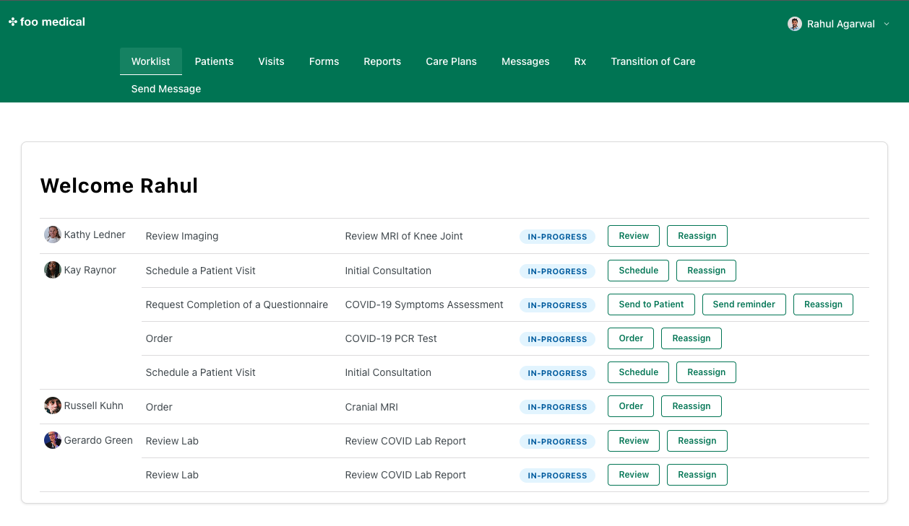

<h1 align="center">Foo Provider</h1>
<p align="center">A free and open-source physician portal from the Medplum team.</p>
<p align="center">
  <a href="https://github.com/medplum/foomedical-provider/actions">
    
  </a>
  <a href="https://github.com/medplum/foomedical-provider/blob/main/LICENSE.txt">
    
  </a>
</p>



### What is Foo Medical Provider?

[Foo Medical Provider](https://provider.foomedical.com/) is a **ready to use medical practice sample app** that's open source. It's meant for developers to clone, customize and run.

### Features

- Completely free and open-source
- Secure and compliant [Medplum](https://www.medplum.com) backend, which is also open source
- Customizable Forms and Questionnaires
- Charting
  - Encounters
  - Clinical Notes
  - Lab results
  - Imaging Studies
  - Medications (🚧 under construction)
- Care Plans and Service Menu
- Schedules (🚧 under construction)
- Patient-provider messaging (🚧 under construction)
- All data represented in [FHIR](https://hl7.org/FHIR/)

Foo Medical Provider is designed to be forked and customized for your business' needs.

### Getting Started

First, [fork](https://github.com/medplum/foomedical-provider/fork) and clone the repo.

Next, install the app from your terminal

```bash
npm install
```

Next, run the app

```bash
npm run dev
```

This app should run on `http://localhost:3003/`

By default, Foo Medical Provider uses a shared project to store resources, so you will need to request access. Please complete this [form](https://docs.google.com/forms/d/e/1FAIpQLSf6PKRW0L57MaWjpSPlx61UpHjR2egn28Pq7FcQ-bYh9LBh5A/viewform) and a member of the Medplum team will add you as a Practitioner on this project.

### Deploying your app

To get started deploying your app we recommend making an account on [Vercel](https://vercel.com/), free accounts are available.

- Create a [New Project](https://vercel.com/new) on Vercel
- Link your Github account and load in your forked Foo Medical Provider repository
- All your settings should be preset, just click "Deploy"

### Account Setup

By default, the Foo Medical Provider app uses a shared project.

To use your own organization with Foo Medical Provider you will need to [register a new Project on Medplum](https://docs.medplum.com/tutorials/app/register) and replace the `projectId` on the [sign in page](https://github.com/rahul1/foomedical-provider/blob/main/src/pages/SignInPage.tsx#L10) with your new projectId.

To enable Google Authentication, you will have to set the following values on your [Project's Site Settings](https://app.medplum.com/admin/sites)

- Google Client Id
- Google Client Secret
- Recaptcha Site Key
- Recaptcha Secret Key

Contact the medplum team ([support@medplum.com](mailto:support@medplum.com) or [Discord](https://discord.gg/UBAWwvrVeN])) with any questions.

### Compliance

Medplum backend is HIPAA compliant and SOC 2 certified. Getting an account set up requires registering on [medplum.com](https://www.medplum.com/). Feel free to ask us questions in real time on our [Discord Server](https://discord.gg/UBAWwvrVeN).

### About Medplum

[Medplum](https://www.medplum.com/) is an open-source, API-first EHR. Medplum makes it easy to build healthcare apps quickly with less code.

Medplum supports self-hosting, and provides a [hosted service](https://app.medplum.com/). [Foo Medical Provider](https://provider.foomedical.com/) uses the hosted service as a backend.

- Read our [documentation](https://www.medplum.com/docs)
- Browse our [react component library](https://docs.medplum.com/storybook/index.html?)
- Join our [Discord](https://discord.gg/UBAWwvrVeN)
